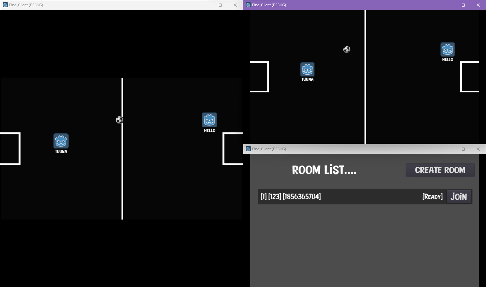
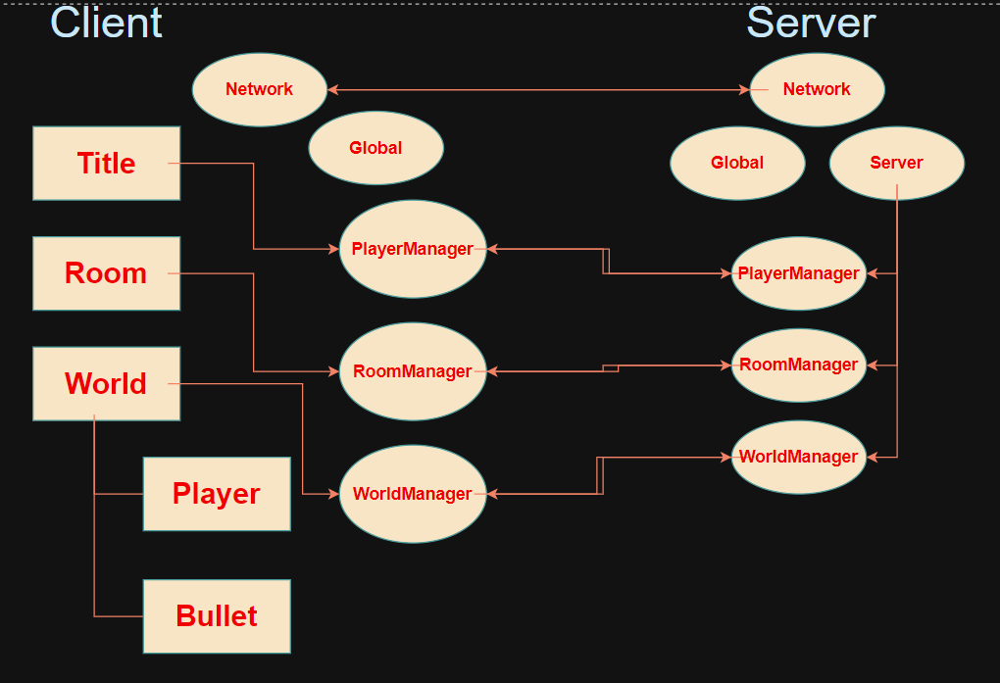

# PING PONG 서버 구조 설명

### 개요

방안에 참여자가 서로에게 공을 날려 맞추는 멀티 게임이다. 

### 구조

클라이언트와 서버의 구조는 위의 형태를 이룬다.

- Title
    - 클라이언트의 이름 값을 입력받으며 “connect server” 버튼 클릭시 Network 노드객체가 서버의 Network와의 연결을 성립한다.
    - 클라이언트의 입력한 값은 클라이언트의 PlayerManager 객체를 통해 서버의 PlayerManager의 객체와 원격프로시저로 통신을 시도한다.
    - 만약 정상적으로 처리가 되었다면 서버의 Global 노드의 player_list에 해당 플레이어가 추가된다.
    
- Room
    - 클라이언트가 입력한 이름값을 서버가 정상적으로 처리했다면 방을 만들거나 접속할 수 있는 Room Scene으로 변경된다.
    - 방을 만들경우
        - 방 제목을 설정하고 서버에 전송하여 서버에서 정상적으로 처리된다면 Global 노드의 room_list에 해당 방을 추가한다.
        - 그리고 World Scene으로 변경한다.
        - 서버는 Worlds 객체에 해당 room index로 명명된 World 객체를 생성하여 Worlds객체의 자식으로 추가하여 해당 방을 관리한다.
    - 만들어진 방에 참여할 경우
        - Boarding 상태인 방에 join 버튼을 클릭하여 참여를 시도한다.
        - 서버에서 정상적으로 처리가 된다면 해당 플레이어는 World Scene으로 변경하고 이미 접속하고 있는 플레이어에게 해당 플레이어가 참여했음을 원격프로시저로 알린다.
    
- World
    - 자신이 움직일 player객체를 만든다.
    - 접속에 참여하는 플레이어에 대해 원격 프로시저 호출을 받으면 해당 유저를 생성한다.
    - 0.03초 마다 서버에 자신의 player객체에대해 velocity, global_position 값을 전송한다.
    - 서버의 WorldManager는 받은 palyer객체의 정보를 참여하고 있는 다른 플레이어에게 원격 프로시저로 해당 정보를 전송한다.
    - 전송받은 다른 플레이어의 정보를 해당 플레이어에 업데이트를 진행한다.

- 만약 해당 플레이어가 disconnected됨을 서버에서 감지했을 때
    - Global노드의 player_list에 해당 player를 삭제한다.
    - Global 노드의 room_list에 해당 player가 속해있는 room에 player를 삭제한다.
    - 해당 player가 참여하고 있는 방이 있는 경우
        - 해당 방의 owner인경우
            - 다른 참여자에게 owner권한을 넘긴다.
        - 참여자들에게 해당 player가 연결이 끊어졌음을 원격프로시저로 알린다.
            - 연결이 끊어졌음을 알림받은 클라이언트는 World객체에 속해있는 해당 플레이어를 queue_free하여 삭제한다.
        
        - 해당방에 참여자가 disconnected된 플레이어라면 Global노드의 room_list에 해당 플레이어가 속해있는 room을 삭제하고 서버의 Worlds노드에 자식으로 붙어있는 world노드를 queue_free하여 삭제한다.